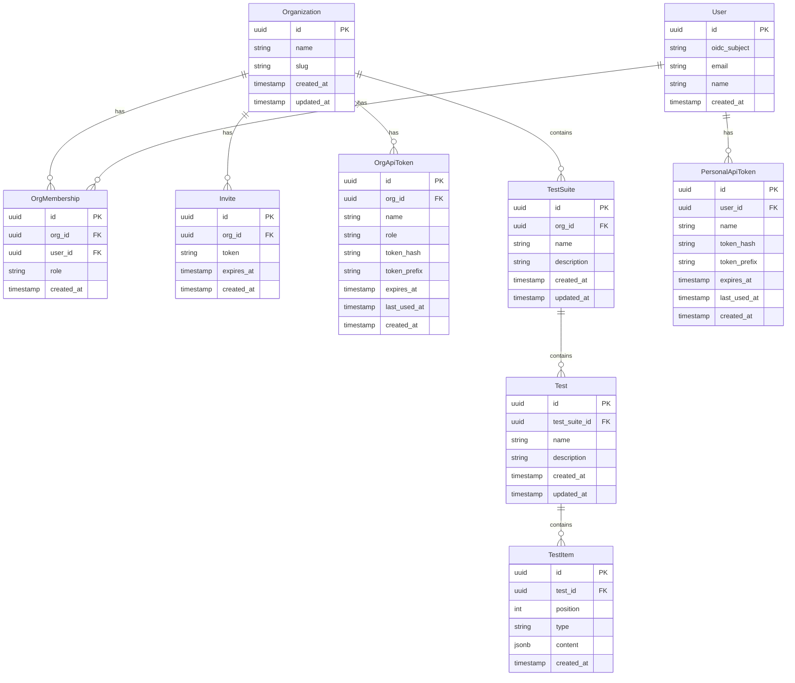

# Data Model

## Entity Relationship



## Entities

### Organization

Top-level tenant. All resources are scoped to an organization.

| Field | Type | Description |
|-------|------|-------------|
| `id` | UUID | Primary key |
| `name` | string | Display name |
| `slug` | string | URL-safe identifier, unique globally |
| `created_at` | timestamp | Creation time |
| `updated_at` | timestamp | Last modification time |

### User

A person authenticated via OIDC.

| Field | Type | Description |
|-------|------|-------------|
| `id` | UUID | Primary key |
| `oidc_subject` | string | OIDC subject claim (`sub`), unique |
| `email` | string | Email address |
| `name` | string | Display name |
| `created_at` | timestamp | Creation time |

### OrgMembership

Joins a user to an organization with a role.

| Field | Type | Description |
|-------|------|-------------|
| `id` | UUID | Primary key |
| `org_id` | UUID | FK → Organization |
| `user_id` | UUID | FK → User |
| `role` | enum | `admin` or `member` |
| `created_at` | timestamp | Creation time |

**Constraints:**
- Unique on `(org_id, user_id)` — a user has one role per organization.

**Roles:**
- `admin` — full access: manage members, invites, test suites, tests.
- `member` — manage test suites and tests. Cannot manage members or invites.

### Invite

A temporary invite link for joining an organization.

| Field | Type | Description |
|-------|------|-------------|
| `id` | UUID | Primary key |
| `org_id` | UUID | FK → Organization |
| `token` | string | Random token, unique, used in the invite URL |
| `expires_at` | timestamp | Expiration time |
| `created_at` | timestamp | Creation time |

The invite flow:
1. Admin generates an invite for the organization.
2. The service returns a URL containing the token.
3. The invited user opens the URL, authenticates via OIDC, and is added to the organization as a `member`.
4. The invite is deleted after use.

### PersonalApiToken

User-scoped API token. Personal tokens inherit all organization memberships and roles of the user.

| Field | Type | Description |
|-------|------|-------------|
| `id` | UUID | Primary key |
| `user_id` | UUID | FK → User |
| `name` | string | Display name |
| `token_hash` | string | SHA-256 hash of the raw token |
| `token_prefix` | string | First 8 chars of the raw token |
| `expires_at` | timestamp | Optional expiration time |
| `last_used_at` | timestamp | Last time the token was used |
| `created_at` | timestamp | Creation time |

### OrgApiToken

Organization-scoped API token with a fixed role.

| Field | Type | Description |
|-------|------|-------------|
| `id` | UUID | Primary key |
| `org_id` | UUID | FK → Organization |
| `name` | string | Display name |
| `role` | enum | `admin` or `member` |
| `token_hash` | string | SHA-256 hash of the raw token |
| `token_prefix` | string | First 8 chars of the raw token |
| `expires_at` | timestamp | Optional expiration time |
| `last_used_at` | timestamp | Last time the token was used |
| `created_at` | timestamp | Creation time |

### TestSuite

A grouping of related tests within an organization.

| Field | Type | Description |
|-------|------|-------------|
| `id` | UUID | Primary key |
| `org_id` | UUID | FK → Organization |
| `name` | string | Display name, unique within the organization |
| `description` | string | Optional description |
| `created_at` | timestamp | Creation time |
| `updated_at` | timestamp | Last modification time |

### Test

A single predefined conversation. The test name is used as the `model` field in Responses API requests.

| Field | Type | Description |
|-------|------|-------------|
| `id` | UUID | Primary key |
| `test_suite_id` | UUID | FK → TestSuite |
| `name` | string | Identifier used as model name in API requests, unique within the test suite |
| `description` | string | Optional description |
| `created_at` | timestamp | Creation time |
| `updated_at` | timestamp | Last modification time |

### TestItem

A single item in a test's conversation sequence. Items are ordered by `position` and follow the OpenAI Responses API item types.

| Field | Type | Description |
|-------|------|-------------|
| `id` | UUID | Primary key |
| `test_id` | UUID | FK → Test |
| `position` | integer | Zero-based position in the sequence |
| `type` | enum | Item type (see below) |
| `content` | jsonb | Item content, structure depends on `type` |
| `created_at` | timestamp | Creation time |

**Constraints:**
- Unique on `(test_id, position)` — no duplicate positions within a test.
- `position` values are contiguous starting from 0.

## Item Types

TestItems represent items in the OpenAI Responses API format. The `type` field determines the role of the item and the structure of `content`.

Items are classified as **input items** or **output items**:
- **Input items** — items sent by the caller to the model. The Responses API endpoint matches incoming `input` against these.
- **Output items** — items returned by the model. The Responses API endpoint returns these when input matches.

### `message` (input)

An input message from a user, system, or developer.

| Field | Type | Description |
|-------|------|-------------|
| `role` | enum | `user`, `system`, or `developer` |
| `content` | string | Message text |

```json
{
  "type": "message",
  "content": {
    "role": "user",
    "content": "What is the weather in San Francisco?"
  }
}
```

### `message` (output)

An output message from the assistant.

| Field | Type | Description |
|-------|------|-------------|
| `role` | enum | `assistant` |
| `content` | string | Message text |

```json
{
  "type": "message",
  "content": {
    "role": "assistant",
    "content": "The weather in San Francisco is 65°F and sunny."
  }
}
```

The distinction between input and output messages is determined by `role`: `user`, `system`, `developer` are input; `assistant` is output.

### `function_call` (output)

A function call emitted by the model.

| Field | Type | Description |
|-------|------|-------------|
| `call_id` | string | Unique identifier for this function call |
| `name` | string | Function name |
| `arguments` | string | JSON-encoded function arguments |

```json
{
  "type": "function_call",
  "content": {
    "call_id": "call_abc123",
    "name": "get_weather",
    "arguments": "{\"location\":\"San Francisco\",\"unit\":\"fahrenheit\"}"
  }
}
```

### `function_call_output` (input)

The result of a function call, sent back by the caller.

| Field | Type | Description |
|-------|------|-------------|
| `call_id` | string | The `call_id` from the corresponding `function_call` |
| `output` | string | Function result as a string |

```json
{
  "type": "function_call_output",
  "content": {
    "call_id": "call_abc123",
    "output": "{\"temperature\":65,\"unit\":\"fahrenheit\",\"condition\":\"sunny\"}"
  }
}
```

## Item Classification Summary

| Type | Role/Direction | Sent by | Matched against input? |
|------|---------------|---------|----------------------|
| `message` (role: `user`/`system`/`developer`) | input | Caller | Yes |
| `message` (role: `assistant`) | output | Model | No — returned as response |
| `function_call` | output | Model | No — returned as response |
| `function_call_output` | input | Caller | Yes |

## Example Test Sequence

A test for an agent that checks the weather:

| Position | Type | Direction | Content Summary |
|----------|------|-----------|----------------|
| 0 | `message` | input | `system`: "You are a weather assistant..." |
| 1 | `message` | input | `user`: "What is the weather in San Francisco?" |
| 2 | `function_call` | output | `get_weather({"location":"San Francisco"})` |
| 3 | `function_call_output` | input | `{"temperature":65,"condition":"sunny"}` |
| 4 | `message` | output | `assistant`: "The weather in San Francisco is 65°F and sunny." |

Responses API interactions:

1. **First request** — agent sends `input: [system message, user message]` → service matches positions 0–1, returns position 2 (`function_call`).
2. **Second request** — agent sends `input: [system message, user message, function_call, function_call_output]` → service matches positions 0–3, returns position 4 (`assistant message`).
