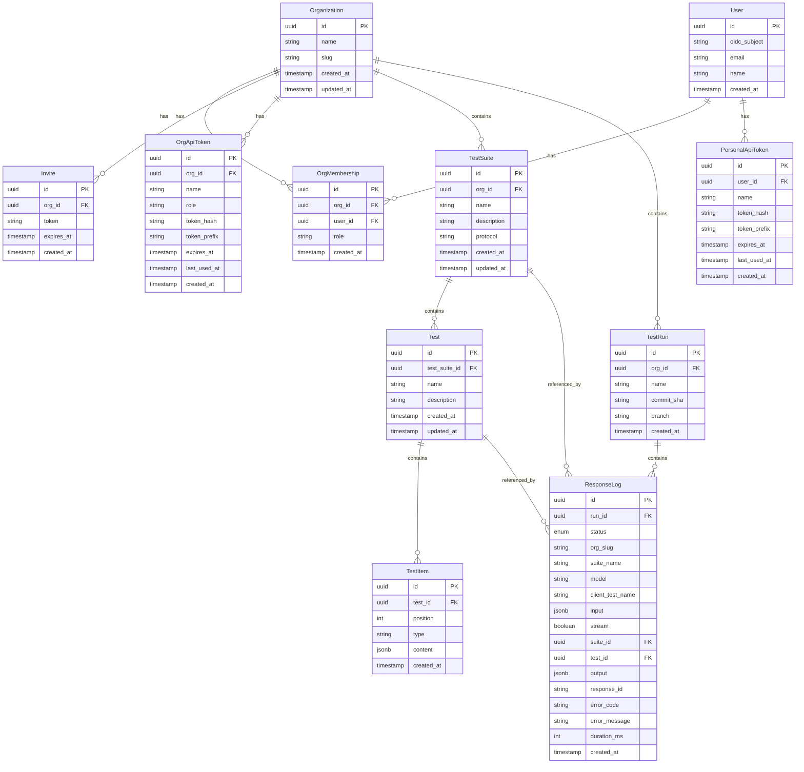

# Data Model

## Entity Relationship



## Entities

### Organization

Top-level tenant. All resources are scoped to an organization.

| Field | Type | Description |
|-------|------|-------------|
| `id` | UUID | Primary key |
| `name` | string | Display name |
| `slug` | string | URL-safe identifier, unique globally |
| `created_at` | timestamp | Creation time |
| `updated_at` | timestamp | Last modification time |

### User

A person authenticated via OIDC.

| Field | Type | Description |
|-------|------|-------------|
| `id` | UUID | Primary key |
| `oidc_subject` | string | OIDC subject claim (`sub`), unique |
| `email` | string | Email address |
| `name` | string | Display name |
| `created_at` | timestamp | Creation time |

### OrgMembership

Joins a user to an organization with a role.

| Field | Type | Description |
|-------|------|-------------|
| `id` | UUID | Primary key |
| `org_id` | UUID | FK → Organization |
| `user_id` | UUID | FK → User |
| `role` | enum | `admin` or `member` |
| `created_at` | timestamp | Creation time |

**Constraints:**
- Unique on `(org_id, user_id)` — a user has one role per organization.

**Roles:**
- `admin` — full access: manage members, invites, test suites, tests.
- `member` — manage test suites and tests. Cannot manage members or invites.

### Invite

A temporary invite link for joining an organization.

| Field | Type | Description |
|-------|------|-------------|
| `id` | UUID | Primary key |
| `org_id` | UUID | FK → Organization |
| `token` | string | Random token, unique, used in the invite URL |
| `expires_at` | timestamp | Expiration time |
| `created_at` | timestamp | Creation time |

The invite flow:
1. Admin generates an invite for the organization.
2. The service returns a URL containing the token.
3. The invited user opens the URL, authenticates via OIDC, and is added to the organization as a `member`.
4. The invite is deleted after use.

### PersonalApiToken

User-scoped API token. Personal tokens inherit all organization memberships and roles of the user.

| Field | Type | Description |
|-------|------|-------------|
| `id` | UUID | Primary key |
| `user_id` | UUID | FK → User |
| `name` | string | Display name |
| `token_hash` | string | SHA-256 hash of the raw token |
| `token_prefix` | string | First 8 chars of the raw token |
| `expires_at` | timestamp | Optional expiration time |
| `last_used_at` | timestamp | Last time the token was used |
| `created_at` | timestamp | Creation time |

### OrgApiToken

Organization-scoped API token with a fixed role.

| Field | Type | Description |
|-------|------|-------------|
| `id` | UUID | Primary key |
| `org_id` | UUID | FK → Organization |
| `name` | string | Display name |
| `role` | enum | `admin` or `member` |
| `token_hash` | string | SHA-256 hash of the raw token |
| `token_prefix` | string | First 8 chars of the raw token |
| `expires_at` | timestamp | Optional expiration time |
| `last_used_at` | timestamp | Last time the token was used |
| `created_at` | timestamp | Creation time |

### TestSuite

A grouping of related tests within an organization.

| Field | Type | Description |
|-------|------|-------------|
| `id` | UUID | Primary key |
| `org_id` | UUID | FK → Organization |
| `name` | string | Display name, unique within the organization |
| `description` | string | Optional description |
| `protocol` | enum | Protocol used by the suite (`openai` or `anthropic`) |
| `created_at` | timestamp | Creation time |
| `updated_at` | timestamp | Last modification time |

### Test

A single predefined conversation. The test name is used as the `model` field in Responses or Messages API requests.

| Field | Type | Description |
|-------|------|-------------|
| `id` | UUID | Primary key |
| `test_suite_id` | UUID | FK → TestSuite |
| `name` | string | Identifier used as model name in API requests, unique within the test suite |
| `description` | string | Optional description |
| `created_at` | timestamp | Creation time |
| `updated_at` | timestamp | Last modification time |

### TestItem

A single item in a test's conversation sequence. Items are ordered by `position` and follow the protocol-specific item types for the parent suite.

| Field | Type | Description |
|-------|------|-------------|
| `id` | UUID | Primary key |
| `test_id` | UUID | FK → Test |
| `position` | integer | Zero-based position in the sequence |
| `type` | enum | Item type (see below) |
| `content` | jsonb | Item content, structure depends on `type` |
| `created_at` | timestamp | Creation time |

**Constraints:**
- Unique on `(test_id, position)` — no duplicate positions within a test.
- `position` values are contiguous starting from 0.

### TestRun

A container for a single CI/test execution. Groups all Responses API calls made during one run. Test runs are scoped to an organization.

The run ID is **client-generated** — the caller provides a UUID when making Responses API calls on the run-tracking path. The TestRun record is created lazily on the first call that references it.

TestRun has no status or lifecycle fields. Duration and timing are derived from the timestamps of the associated response logs.

| Field | Type | Description |
|-------|------|-------------|
| `id` | UUID | Primary key (client-generated) |
| `org_id` | UUID | FK → Organization |
| `name` | string | Optional display name (set via Management API) |
| `commit_sha` | string | Optional Git commit SHA (set via Management API) |
| `branch` | string | Optional Git branch name (set via Management API) |
| `created_at` | timestamp | Creation time |

**Indexes:**
- `(org_id, created_at)` — efficient listing of runs by organization.

### ResponseLog

Records a single Responses or Messages API call attributed to a test run. Created via fire-and-forget after each tracked request.

| Field | Type | Description |
|-------|------|-------------|
| `id` | UUID | Primary key |
| `run_id` | UUID | FK → TestRun |
| `status` | enum | `success` or `error` |
| `org_slug` | string | Organization slug from the request path |
| `suite_name` | string | Test suite name from the request path |
| `model` | string | Model (test name) from the request body |
| `client_test_name` | string | Client-provided test identifier from the request path |
| `input` | jsonb | The full `input` from the request body |
| `stream` | boolean | Whether streaming was requested (default `false`) |
| `suite_id` | UUID | FK → TestSuite (nullable). Set when the suite was resolved successfully. `NULL` if suite not found. Set to `NULL` on suite deletion (`onDelete: SetNull`). |
| `test_id` | UUID | FK → Test (nullable). Set when the test (model) was resolved successfully. `NULL` if test not found. Set to `NULL` on test deletion (`onDelete: SetNull`). |
| `output` | jsonb | The full response payload on success. `NULL` on error. |
| `response_id` | string | The `id` field from the response payload. `NULL` on error. |
| `error_code` | string | Error code on failure (e.g., `suite_not_found`, `input_mismatch`). `NULL` on success. |
| `error_message` | string | Error message on failure. `NULL` on success. |
| `duration_ms` | integer | Time spent on the matching logic in milliseconds |
| `created_at` | timestamp | Creation time |

**Indexes:**
- `(run_id, created_at)` — list logs by run in chronological order.
- `(run_id, client_test_name)` — filter logs by client test name within a run.
- `(run_id, test_id)` — filter logs by resolved test within a run.
- `(suite_id, created_at)` — list logs by suite.
- `(test_id, created_at)` — list logs by test.

**Status values:**

| Value | Meaning |
|-------|---------|
| `success` | Input matched, response returned successfully |
| `error` | Resolution failed (suite not found, model not found, input mismatch, sequence exhausted) |

### Test Executions (Query-Time Concept)

A "test execution" is not a database entity. It is a **query-time grouping** of response logs by `client_test_name` within a test run.

- A test execution is **passed** if every response log with that `(run_id, client_test_name)` has `status = 'success'`.
- A test execution is **failed** if any response log has `status = 'error'`.
- `tests_total` = count of distinct `client_test_name` values in the run.
- `tests_passed` / `tests_failed` = derived from the above rule.

This design allows a single TestLLM test (conversation sequence) to be reused by multiple client-side tests, each identified by a unique `client_test_name`.

## Item Types

TestItems represent protocol-specific items. The `type` field determines the role of the item and the structure of `content`.

Items are classified as **input items** or **output items**:
- **Input items** — items sent by the caller to the model. The Responses or Messages endpoint matches incoming inputs against these.
- **Output items** — items returned by the model. The endpoint returns these when input matches.

### OpenAI Responses API types

### `message` (input)

An input message from a user, system, or developer.

| Field | Type | Description |
|-------|------|-------------|
| `role` | enum | `user`, `system`, or `developer` |
| `content` | string | Message text |

```json
{
  "type": "message",
  "content": {
    "role": "user",
    "content": "What is the weather in San Francisco?"
  }
}
```

### `message` (output)

An output message from the assistant.

| Field | Type | Description |
|-------|------|-------------|
| `role` | enum | `assistant` |
| `content` | string | Message text |

```json
{
  "type": "message",
  "content": {
    "role": "assistant",
    "content": "The weather in San Francisco is 65°F and sunny."
  }
}
```

The distinction between input and output messages is determined by `role`: `user`, `system`, `developer` are input; `assistant` is output.

### `function_call` (output)

A function call emitted by the model.

| Field | Type | Description |
|-------|------|-------------|
| `call_id` | string | Unique identifier for this function call |
| `name` | string | Function name |
| `arguments` | string | JSON-encoded function arguments |

```json
{
  "type": "function_call",
  "content": {
    "call_id": "call_abc123",
    "name": "get_weather",
    "arguments": "{\"location\":\"San Francisco\",\"unit\":\"fahrenheit\"}"
  }
}
```

### Anthropic Messages API types

Anthropic suites use two item types:

- `anthropic_system` — system prompt stored as either `{ "text": "..." }` or `{ "blocks": [ ... ] }`.
- `anthropic_message` — user or assistant messages stored with a `role` (`user` or `assistant`) and `content` as a string or array of content blocks.

Content blocks follow the Anthropic Messages API format:

- `text` — `{ "type": "text", "text": "..." }`
- `tool_use` — `{ "type": "tool_use", "id": "...", "name": "...", "input": { ... } }`
- `tool_result` — `{ "type": "tool_result", "tool_use_id": "...", "content": "..." }`

```json
{
  "type": "anthropic_system",
  "content": {
    "text": "You are a weather assistant."
  }
}
```

```json
{
  "type": "anthropic_message",
  "content": {
    "role": "user",
    "content": [
      {
        "type": "text",
        "text": "Weather in SF?"
      }
    ]
  }
}
```

### `function_call_output` (input)

The result of a function call, sent back by the caller.

| Field | Type | Description |
|-------|------|-------------|
| `call_id` | string | The `call_id` from the corresponding `function_call` |
| `output` | string | Function result as a string |

```json
{
  "type": "function_call_output",
  "content": {
    "call_id": "call_abc123",
    "output": "{\"temperature\":65,\"unit\":\"fahrenheit\",\"condition\":\"sunny\"}"
  }
}
```

## Item Classification Summary

| Type | Role/Direction | Sent by | Matched against input? |
|------|---------------|---------|----------------------|
| `message` (role: `user`/`system`/`developer`) | input | Caller | Yes |
| `message` (role: `assistant`) | output | Model | No — returned as response |
| `function_call` | output | Model | No — returned as response |
| `function_call_output` | input | Caller | Yes |

## Example Test Sequence

A test for an agent that checks the weather:

| Position | Type | Direction | Content Summary |
|----------|------|-----------|----------------|
| 0 | `message` | input | `system`: "You are a weather assistant..." |
| 1 | `message` | input | `user`: "What is the weather in San Francisco?" |
| 2 | `function_call` | output | `get_weather({"location":"San Francisco"})` |
| 3 | `function_call_output` | input | `{"temperature":65,"condition":"sunny"}` |
| 4 | `message` | output | `assistant`: "The weather in San Francisco is 65°F and sunny." |

Responses API interactions:

1. **First request** — agent sends `input: [system message, user message]` → service matches positions 0–1, returns position 2 (`function_call`).
2. **Second request** — agent sends `input: [system message, user message, function_call, function_call_output]` → service matches positions 0–3, returns position 4 (`assistant message`).
