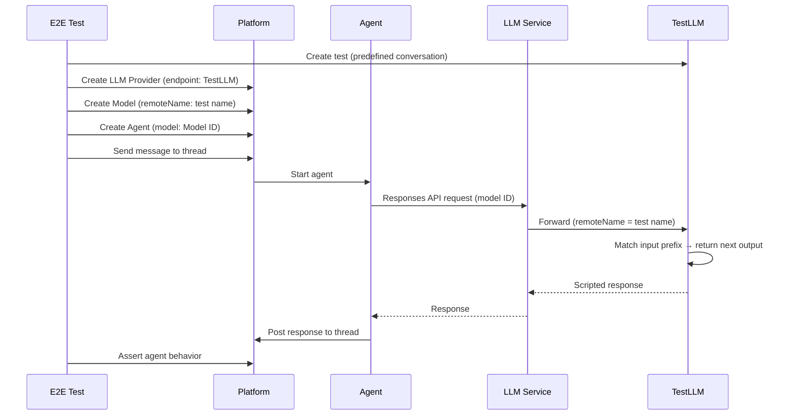

# TestLLM

## Overview

TestLLM is a deterministic LLM service for end-to-end testing of AI agents. It exposes OpenAI-compatible Responses API and Anthropic Messages API protocols backed by predefined conversation sequences. Instead of calling a real LLM, test infrastructure points agents at TestLLM, which replays scripted responses — making agent behavior fully deterministic and assertable.

## Problem

Agents depend on LLM responses for decision-making, tool calling, and message generation. Real LLMs are non-deterministic — the same input can produce different outputs across runs. This makes it impossible to write E2E tests with assertions on agent behavior. Mocking the LLM client inside the agent breaks the E2E testing principle of testing real deployments with real service interactions.

## Solution

TestLLM acts as an LLM provider. The test creates an LLM Provider resource in the platform pointing at the TestLLM endpoint and a Model resource referencing a predefined test (conversation). The agent uses the standard LLM service proxy path and hits TestLLM instead of a real provider.

A **test** is an ordered sequence of items following the protocol configured for its test suite (OpenAI Responses or Anthropic Messages). Each request is matched against the test sequence by comparing incoming inputs with the expected prefix. On exact match, the service returns the next output items from the sequence. On mismatch, it returns an error.

This makes LLM interactions fully deterministic: the agent receives the exact scripted responses, makes the exact scripted tool calls, and produces the exact expected behavior — testable with standard assertions.

For observability, TestLLM supports **test run tracking**. A test run groups all Responses or Messages API calls from a single CI execution. Each call is recorded as a response log with full request/response data, timing, and pass/fail status. The Management API and UI provide run summaries, per-test-execution breakdowns, and detailed log inspection — giving visibility into exactly what happened during each test execution.



## Tech Stack

| Component | Technology |
|-----------|-----------|
| Framework | Next.js |
| Hosting | Vercel |
| Database | PostgreSQL (Supabase) |
| Auth | OIDC (independent provider) |

## Tenancy Model

TestLLM is multi-tenant. The hierarchy:

```
Organization
├── Test Suite
│   └── Test
└── Test Run
    └── Response Log
```

- **Organization** — top-level tenant. Users are invited to organizations.
- **Test Suite** — a grouping of related tests within an organization.
- **Test** — a single predefined conversation (ordered sequence of protocol-specific items). The test name is used as the model identifier in Responses or Messages API requests. Test names are unique within a test suite.
- **Test Run** — a container for a single CI/test execution. Groups all Responses or Messages API calls made during one run. Created lazily on the first tracked API call. The run ID is client-generated (UUID).
- **Response Log** — a record of a single Responses or Messages API call within a test run. Captures input, output (or error), timing, and resolution metadata.

## Documentation

| Document | Description |
|----------|-------------|
| [Data Model](data-model.md) | Database entities, relationships, item types |
| [Responses API](responses-api.md) | OpenAI-compatible endpoint — request matching, response generation, error handling, run tracking |
| [Messages API](messages-api.md) | Anthropic-compatible endpoint — request matching, response generation, error handling, run tracking |
| [Management API](management-api.md) | CRUD operations for organizations, test suites, tests, user management, and test runs |
| [Authentication](authentication.md) | OIDC for management UI/API, no auth for Responses API |
