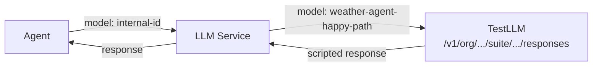

# Responses API

The Responses API endpoint is the core of TestLLM. It implements the OpenAI Responses API protocol, accepting the same request format and returning the same response format — but backed by predefined test sequences instead of a real LLM.

## Endpoint

```
POST /v1/org/{orgSlug}/suite/{suiteName}/responses
```

| Path Parameter | Type | Description |
|---------------|------|-------------|
| `orgSlug` | string | Organization slug |
| `suiteName` | string | Test suite name |

**Authentication:** None. The Responses API is unauthenticated — callers (agents via the LLM service proxy) do not need credentials.

## Request

The request body follows the OpenAI Responses API `create` format. TestLLM uses two fields from the request:

| Field | Type | Description |
|-------|------|-------------|
| `model` | string | The test name within the test suite. Used to look up the test. |
| `input` | string or array | Input items. A string is treated as a single user message. An array contains message, function_call, and function_call_output items. |

All other fields in the request (`tools`, `temperature`, `instructions`, `text`, etc.) are accepted but ignored. This ensures compatibility with any OpenAI client configuration — the service does not reject unknown fields.

### Example Request

```json
{
  "model": "weather-agent-happy-path",
  "input": [
    {
      "role": "system",
      "content": "You are a weather assistant."
    },
    {
      "role": "user",
      "content": "What is the weather in San Francisco?"
    }
  ]
}
```

## Matching Algorithm

On each request, the service:

1. **Resolves the test** — looks up the test by `model` (test name) within the specified organization and test suite (from the URL path).
2. **Normalizes input** — if `input` is a string, wraps it as `[{"role": "user", "content": "<string>"}]`.
3. **Loads the test sequence** — retrieves all test items ordered by `position`.
4. **Extracts the expected input prefix** — collects consecutive input items from the beginning of the sequence up to (but not including) the first output item that has not yet been matched by prior input.
5. **Compares** — performs exact match of the request input items against the expected input prefix. Comparison rules:
   - **Message items**: `role` and `content` must match exactly.
   - **Function call items**: `type`, `call_id`, `name`, and `arguments` must match exactly.
   - **Function call output items**: `type`, `call_id`, and `output` must match exactly.
6. **Returns output** — if the input matches, returns all consecutive output items immediately following the matched prefix.

### Matching Walk-Through

Given a test sequence:

| Pos | Type | Dir | Content |
|-----|------|-----|---------|
| 0 | `message` | input | `system`: "You are a weather assistant." |
| 1 | `message` | input | `user`: "What is the weather in SF?" |
| 2 | `function_call` | output | `get_weather({"location":"SF"})` |
| 3 | `function_call_output` | input | `{"temperature":65}` |
| 4 | `message` | output | `assistant`: "It's 65°F in SF." |

**Request 1** — input: `[system msg, user msg]`

- Expected input prefix: positions 0–1 (all input items before first output).
- Match: exact ✓
- Return: position 2 (`function_call`). Only position 2 is returned because position 3 is an input item (the next turn starts with caller-provided data).

**Request 2** — input: `[system msg, user msg, function_call, function_call_output]`

- Expected input prefix: positions 0–3 (all input items before the next unmatched output).
- Match: exact ✓
- Return: position 4 (`assistant message`).

### Multiple Output Items

A single turn may produce multiple output items. For example, the model may return a message and a function call together, or multiple function calls. All consecutive output items following the matched input prefix are returned in a single response.

## Response

The response follows the OpenAI Responses API response format.

### Success Response

```json
{
  "id": "resp_<generated-uuid>",
  "object": "response",
  "created_at": 1700000000,
  "model": "weather-agent-happy-path",
  "output": [
    {
      "id": "fc_<generated-uuid>",
      "type": "function_call",
      "call_id": "call_abc123",
      "name": "get_weather",
      "arguments": "{\"location\":\"San Francisco\"}",
      "status": "completed"
    }
  ],
  "status": "completed"
}
```

When output items are messages:

```json
{
  "id": "resp_<generated-uuid>",
  "object": "response",
  "created_at": 1700000000,
  "model": "weather-agent-happy-path",
  "output": [
    {
      "id": "msg_<generated-uuid>",
      "type": "message",
      "role": "assistant",
      "status": "completed",
      "content": [
        {
          "type": "output_text",
          "text": "The weather in San Francisco is 65°F and sunny.",
          "annotations": []
        }
      ]
    }
  ],
  "status": "completed"
}
```

### Output Item Formatting

TestItem content is stored in a simplified format (see [Data Model](data-model.md)). The Responses API endpoint transforms items into the full OpenAI response format:

| TestItem type | Response output format |
|--------------|----------------------|
| `message` (assistant) | `{"type": "message", "role": "assistant", "content": [{"type": "output_text", "text": "..."}], "status": "completed"}` |
| `function_call` | `{"type": "function_call", "call_id": "...", "name": "...", "arguments": "...", "status": "completed"}` |

## Error Handling

All errors use the OpenAI error response format:

```json
{
  "error": {
    "message": "...",
    "type": "...",
    "code": "..."
  }
}
```

### Error Cases

| Condition | HTTP Status | Error Type | Error Code | Message |
|-----------|-------------|------------|------------|---------|
| Organization not found | 404 | `not_found_error` | `org_not_found` | `Organization '{orgSlug}' not found` |
| Test suite not found | 404 | `not_found_error` | `suite_not_found` | `Test suite '{suiteName}' not found in organization '{orgSlug}'` |
| Test (model) not found | 404 | `not_found_error` | `model_not_found` | `Model '{model}' not found in suite '{suiteName}'` |
| Input mismatch | 400 | `invalid_request_error` | `input_mismatch` | Detailed mismatch description (see below) |
| Input extends beyond test sequence | 400 | `invalid_request_error` | `sequence_exhausted` | `Input extends beyond the defined test sequence` |

### Mismatch Error Detail

When input does not match the expected prefix, the error message includes:
- The position where the mismatch occurred.
- The expected item at that position.
- The actual item received.

```json
{
  "error": {
    "message": "Input mismatch at position 1: expected message with role 'user' and content 'What is the weather in SF?', got message with role 'user' and content 'What is the weather in New York?'",
    "type": "invalid_request_error",
    "code": "input_mismatch"
  }
}
```

## Integration with Platform

TestLLM integrates with the Agyn platform through the standard LLM provider mechanism:

1. **Create an LLM Provider** in the platform with `endpoint` set to the TestLLM base URL (e.g., `https://testllm.example.com/v1/org/my-org/suite/my-suite`).
2. **Create a Model** with `remoteName` set to the test name (e.g., `weather-agent-happy-path`).
3. **Create or configure an Agent** to use the model.

The LLM service proxies the agent's Responses API request to TestLLM, replacing the model ID with the remote name. TestLLM matches the input and returns the scripted response. The agent behaves exactly as it would with a real LLM — but deterministically.


